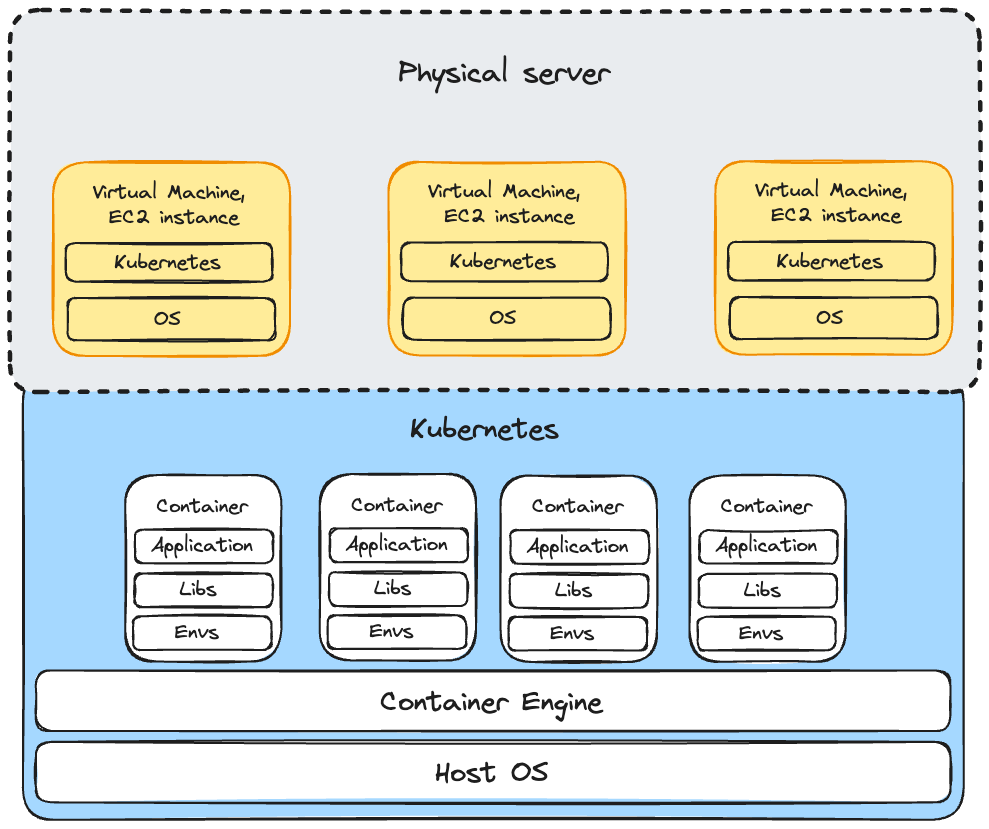

## Comparison: Virtualization vs. Containerization**

| Parameter                     | Virtualization (VMs) | Containerization |
|--------------------------------|----------------------|------------------|
| **Speed**                      | Slower startup time due to OS booting | Faster startup as containers share the host OS |
| **Resources**                  | Requires more resources (CPU, RAM) per VM | Lightweight and shares system resources efficiently |
| **Security & Isolation**        | Strong isolation with separate OS for each VM | Lower isolation, but sandboxing mechanisms improve security |
| **Portability & Application Sharing** | Less portable; VM images are large | Highly portable; images are small and easy to share |
| **Operating System Requirements** | Each VM runs its own OS | Containers share the host OS, reducing overhead |
| **Application Lifecycle**       | VMs are long-lived and managed as whole units | Containers are ephemeral and designed for rapid scaling |

## Virtualization and Containerization Architecture

This section explains how virtualization and containerization work together in an AWS-based microservices setup.

### **1. Physical Server (AWS Data Center)**
- **Role:** Represents the actual physical hardware located in AWS data centers worldwide.
- **Example:** AWS data centers are located in regions such as **us-east-1 (North Virginia), eu-west-1 (Ireland), ap-southeast-1 (Singapore), etc.**

### **2. Virtual Machine (EC2 Instances)**
- **Role:** Each **EC2 instance** is a virtual machine created on top of AWS's physical servers. These provide flexible and scalable computing resources.
- **Components Inside EC2 Instance:**
  - **OS (Operating System):** The guest OS inside the virtual machine (e.g., Ubuntu, Amazon Linux).
  - **Kubernetes (Worker Node):** Kubernetes runs on EC2 instances and manages containers.
- **Example:** A Kubernetes cluster might run across multiple **t3.medium EC2 instances** to host microservices.

### **3. Kubernetes Layer (Container Orchestration)**
- **Role:** Kubernetes is responsible for managing containers across multiple EC2 instances, ensuring high availability, auto-scaling, and load balancing.
- **Key Functions of Kubernetes:**
  - **Pod Scheduling:** Decides which EC2 instance should run which containers.
  - **Scaling:** Automatically adds or removes containers based on demand.
  - **Networking:** Handles internal communication between services using **Service Discovery (ClusterIP, NodePort, LoadBalancer).**
  - **Self-Healing:** Restarts failed containers.
- **Example:** A Kubernetes cluster running in **AWS EKS (Elastic Kubernetes Service)** manages multiple microservices.

### **4. Containers (Microservices)**
- **Role:** Each container runs a **microservice**, which is an independent application that performs a specific function.
- **Components Inside a Container:**
  - **Application:** The actual microservice (e.g., a Node.js API, Python Flask service, or Go-based service).
  - **Libraries:** Required dependencies for the application.
  - **Environment Variables:** Configuration values, such as database connection strings or API keys.
- **Example:** A microservices-based e-commerce platform might have:
  - `cart-service` (Manages shopping carts)
  - `order-service` (Processes orders)
  - `user-service` (Handles authentication)
  - `payment-service` (Manages payments)

### **5. Container Engine (Docker or Containerd)**
- **Role:** The container engine is responsible for running and managing containers.
- **Common Container Engines:**
  - **Docker** (Most popular, used for local development)
  - **Containerd** (Lightweight alternative optimized for Kubernetes)
- **Example:** If you run `docker run nginx`, the **Docker engine** pulls the image and runs it in a container.
- **Analogy:** This is like the **electricity or plumbing system** inside an apartment—it makes sure everything works smoothly.

### **Real-World Example of a Microservices Architecture**
Imagine a **food delivery platform (like Uber Eats)** with multiple microservices running inside Kubernetes:

| **Microservice** | **Purpose** | **Example Language** | **Hosted Inside** |
|-----------------|-------------|----------------------|-------------------|
| `auth-service` | Handles user authentication | Node.js (Express) | Kubernetes Pod |
| `restaurant-service` | Manages restaurant data | Python (Flask) | Kubernetes Pod |
| `order-service` | Processes customer orders | Java (Spring Boot) | Kubernetes Pod |
| `payment-service` | Handles transactions | Go | Kubernetes Pod |
| `notification-service` | Sends SMS/Emails | Ruby on Rails | Kubernetes Pod |
| `frontend` | Web UI | React.js | S3 + CloudFront |

Each microservice runs in its own **container**, managed by **Kubernetes** on top of **EC2 instances** inside AWS.

### **Conclusion**
This architecture efficiently combines **virtualization (EC2)** with **containerization (Kubernetes)** to provide scalability, resilience, and cost efficiency.

