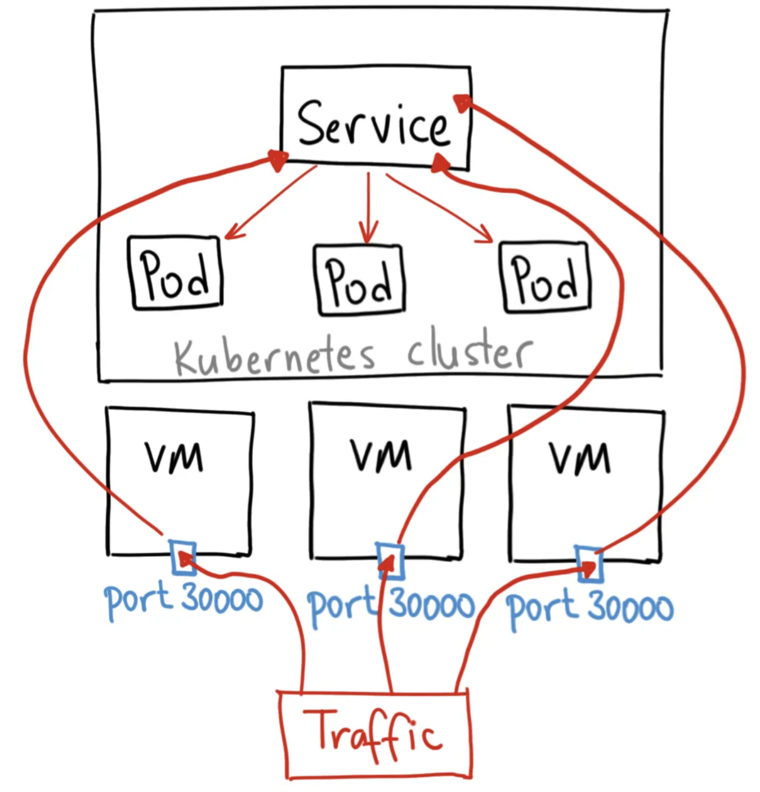

# Understanding NodePort Behavior in Kubernetes

## **📌 What is NodePort?**
A **NodePort** service in Kubernetes allows external access to a cluster service by exposing it on a static port across all nodes. Clients can send requests to `NODE_IP:NODE_PORT`, and Kubernetes routes traffic to the corresponding pod(s).

### **🔹 How NodePort Works:**
1. Kubernetes assigns a **static port** in the range **30000-32767**.
2. Traffic sent to `Node_IP:NodePort` is routed to one of the backing pods.
3. By default, **Kubernetes does not guarantee round-robin load balancing**.
4. If a request is using **HTTP Keep-Alive**, all subsequent requests will go to the same pod until the connection times out.


---

## **🔍 Observed Results & Explanation**
### **1️⃣ Initial Issue: Requests Always Hit the Same Pod**
When using **Postman** or other HTTP clients with **Keep-Alive enabled**, every request was handled by the **same pod** because the connection was persistent.

#### **Why Did This Happen?**
- **Keep-Alive keeps the TCP connection open**, meaning all requests go to the **same backend pod**.
- This behavior is expected because **NodePort does not perform round-robin load balancing by default**.

### **2️⃣ Fix: Disabling Keep-Alive Allowed Load Balancing**
After disabling **Keep-Alive**, each new request was directed to a **different pod**, confirming that **Kubernetes’ internal routing was working correctly**.

#### **Ways to Disable Keep-Alive:**
1. **Postman**: Remove the `Connection: keep-alive` header.
2. **Curl**: Use `Connection: close` header:
   ```sh
   curl -H "Connection: close" http://192.168.1.9:30808/hello
   ```
3. **Disable Keep-Alive in your HTTP client configuration**.

---

## **📊 Summary of NodePort Behavior**
| Test Result | Expected in NodePort? |
|------------|----------------------|
| Requests always hit the same pod | ✅ Yes, with Keep-Alive enabled |
| Requests are distributed to different pods | ✅ Yes, after disabling Keep-Alive |
| NodePort does not provide strict round-robin | ✅ Correct, it's connection-based |


## Examples of queries 

- **Request 1:**
    **GET http://192.168.1.9:30808/hello**
    ```json
    {
        "name": "scm-server-deployment-59c4797bc5-ttv7p",
        "ip": "10.1.243.227",
        "uid": "1dc75528-fc70-4bd6-8841-8505f79ebee2",
        "namespace": "namespace-scm-server",
        "req_ip": "10.0.1.1",
        "req_id": "req-4h"
    }
    ```
- **Request 2:**
    **GET http://192.168.1.9:30808/hello**
    ```json
    {
        "name": "scm-server-deployment-59c4797bc5-j44d2",
        "ip": "10.1.243.232",
        "uid": "61641dd0-2963-4db1-8f28-0b7f7d6223e4",
        "namespace": "namespace-scm-server",
        "req_ip": "10.0.1.1",
        "req_id": "req-5b"
    } 

As we can see requests was handled by different pods.
---

## **🚀 Conclusion**
- **NodePort does not guarantee load balancing** by itself.
- **Keep-Alive forces connections to a single pod**.
- **Disabling Keep-Alive enables load balancing** among replicas.
- For **better load balancing**, consider using an **Ingress Controller** or **LoadBalancer service**.

Let me know if you need more details! 🚀


