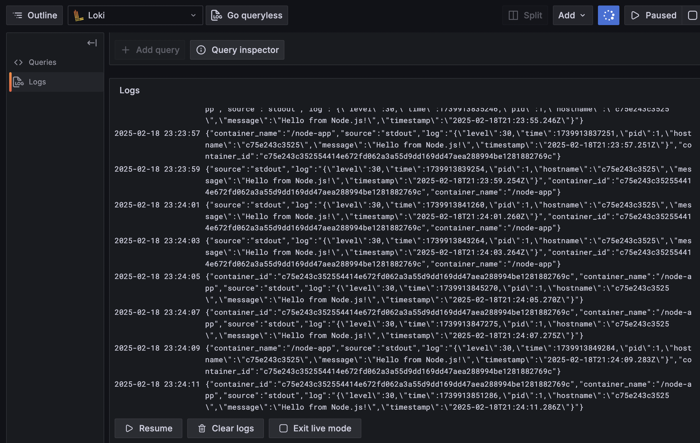

# Centralized Logging System with Fluentd, Loki, and Grafana

## 🚀 Overview
This project sets up a **centralized logging system** using:
- **Fluentd** for collecting and forwarding logs
- **Loki** for storing logs efficiently
- **Grafana** for log visualization
- **Node.js Application** using `pino` logger

The Node.js app logs structured JSON logs to `stdout`, which Fluentd collects and forwards to Loki. Grafana is used to query and visualize logs.

---

## 📂 Project Structure
```
/centralized-logging
│── /fluentd
│   ├── Dockerfile
│   ├── fluent.conf
│── /grafana
│   ├── provisioning
│   │   ├── datasource
│── /app
│   ├── server.js
│   ├── package.json
│   ├── Dockerfile
│── README.md
```

---

## 🛠️ **Run Without Docker Compose**

### 1️⃣ **Create a Docker Network**
```sh
docker network create --driver bridge my_network
```

### 2️⃣ **Run Loki**
```sh
docker run -d --name loki --network my_network -p 3100:3100 grafana/loki:2.9.0
```

### 3️⃣ **Build and Run Fluentd**
```sh
docker build -t custom-fluentd ./fluentd
docker run -d --name fluentd --network my_network \
  -p 24224:24224 -p 24224:24224/udp \
  -v $(pwd)/fluentd/fluent.conf:/fluentd/etc/fluent.conf \
  custom-fluentd
```

### 4️⃣ **Build and Run Grafana**
```sh
docker run -d --name grafana --network my_network -p 3123:3000 \
  -e GF_SECURITY_ADMIN_PASSWORD=admin \
  -e "GF_DASHBOARD_DEFAULT_HOME_DASHBOARD_PATH=/etc/grafana/dashboards/default-dashboard.json" \
  -e GF_SERVER_ROOT_URL=http://localhost:3123 \
  -v $(pwd)/grafana/provisioning:/etc/grafana/provisioning \
  grafana/grafana
```

### 5️⃣ **Build and Run Node.js App**
```sh
docker build -t node-app ./app
docker run -d --name node-app --network my_network \
  --log-driver=fluentd \
  --log-opt fluentd-address=fluentd:24224 \
  --log-opt tag=node-app \
  node-app
```

---

## 🔍 **Access Grafana**
1. Open **Grafana**: [http://localhost:3123](http://localhost:3123)
2. **Login**: `admin / admin`
3. **Add Loki as a Data Source**:
   - Go to **Settings → Data Sources**.
   - Select **Loki**.
   - Set **URL: `http://loki:3100`**.
   - Click **Save & Test**.
4. **Query Logs**:
   - Go to **Explore**.
   - Select **Loki Data Source**.
   - Run:
     ```plaintext
     {app="node-app-logs"} | json
     ```

---
## Results



---

## ✅ Summary
This setup:
- **Uses Fluentd** to collect logs from the Node.js app.
- **Stores logs in Loki**.
- **Visualizes logs in Grafana**.

🚀 **Now you have a working centralized logging system!**


